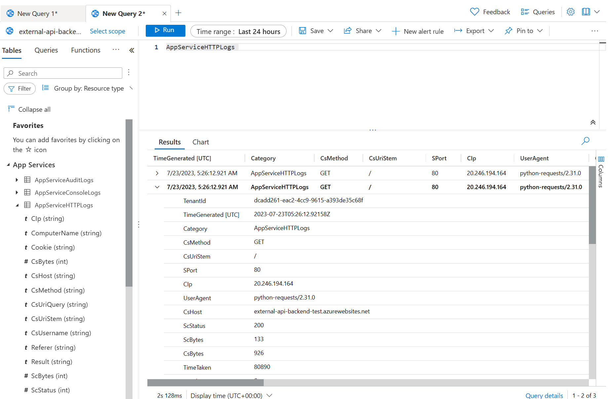

# Sample Test App for AKS

There are multiple use cases in this repo.

1. `outbound-test-config.yml`: Example of **`application gateway ingress controller`** with `kubenet`. Calls external api. Track down what is the source ip address of the request.
   
2. `internal-lb-test-config.yml`: Example of `internal load balancer` with `application gateway` **infront**. 

## Pre-requisites
* Resource group

## Deploying external API app

This demo used Azure App Service with `Python 3.11` runtime.

Deploy external-api with `SCM_DO_BUILD_DURING_DEPLOYMENT` set to `1` & `pip install -r requirements.txt && python -m uvicorn main:app --host 0.0.0.0` as startup command.

After deployment, try `curl <YOUR_URL>` to see if it works.
It needs to reply with `{"message":"Hello World"}`.

> Since python applications need additional settings within code level for the Application Insights & Loggings, this app is using `opencensus-ext-azure` library to automatically send logs to Application Insights.

## Running in local

Update `main.py` request url to the external api app.

```python
response = requests.get(<YOUR_URL>)
```

```bash
cd api-call-app
docker build -t outbound-test-app .
docker run -p 80:80 outbound-test-app
```
Go to `localhost:80` in browser.

Press `Click me` button to see `Hello World`.

## Upload the image to Azure Container Registry

1. Create Azure Container Registry
```bash
az acr create --resource-group myResourceGroup --name <acrName> --sku Basic
```

2. Login to the registry
```bash
az acr login --name <acrName>
```

3. Get ACR server name.
```bash
az acr list --resource-group myResourceGroup --query "[].{acrLoginServer:loginServer}" --output table
```

4. Change the image name & tag
```bash
docker tag outbound-test-app <acrLoginServer>/outbound-test-app:v1
```

5. Push images to registry
```bash
docker push <acrLoginServer>/outbound-test-app:v1
```

<!-- ## Editing `outbound-test-app.yaml` manifest file for `Azure CNI`(Advanced Networking)
If you are using Azure CNI(Advanced networking) for the cluster, you need to delete `outbound-test-service` from the manifest file.

This is because when you use `kubenet` as the networking plugin, the pods are assigned an IP address from another subnet from the Azure VNET. This means that the pods do not know each others' IP addresses and cannot communicate with each other directly. They need a single ClusterIP service to be able to communicate with each other.

In conclusion, using `kubenet` would not benefit from using the Application Gateway Ingress Controller as specified in this [documentation](https://azure.microsoft.com/en-us/blog/application-gateway-ingress-controller-for-azure-kubernetes-service/). 

The benefits of using the AGIC are first, reducing the additional hops and connecting directly to the pods and second, using the Application Gateway features such as WAF, URL-based routing, SSL termination, etc. However as mentioned, `kubenet` does not allow the pods to communicate with each other directly and therefore would actually miss the first benefit of using the AGIC.

```yml
apiVersion: apps/v1
kind: Deployment
metadata:
  name: outbound-test-app
spec:
  replicas: 2
  selector:
    matchLabels:
      app: outbound-test-app
  strategy:
    rollingUpdate:
      maxSurge: 1
      maxUnavailable: 1
  minReadySeconds: 5 
  template:
    metadata:
      labels:
        app: outbound-test-app
    spec:
      nodeSelector:
        "beta.kubernetes.io/os": linux
      containers:
      - name: outbound-test-app
        image: voteappacr0626.azurecr.io/outbound-test-app:v1
        ports:
        - containerPort: 80
        resources:
          requests:
            cpu: 250m
          limits:
            cpu: 500m
# ---
# apiVersion: v1
# kind: Service
# metadata:
#   name: outbound-test-service
# spec:
#   #type: LoadBalancer
#   ports:
#   - port: 80
#   selector:
#     app: outbound-test-app
---
apiVersion: networking.k8s.io/v1
kind: Ingress
metadata:
  name: outbound-test-app
  annotations:
    kubernetes.io/ingress.class: azure/application-gateway
spec:
  rules:
  - http:
      paths:
      - backend:
          service:
            name: outbound-test-app #Update here to outbound-test-app
            port:
              number: 80
        path: /
        pathType: Prefix
``` -->

## Deploying to Azure Kubernets Service
1. Create AKS
```bash
az aks create --resource-group myResourceGroup --name myAKSCluster --node-count 1 --enable-addons monitoring --generate-ssh-keys --attach-acr <acrName>
```

2. Get AKS credentials
```bash
az aks get-credentials --resource-group myResourceGroup --name myAKSCluster
```
3. Update manifest file
```bash
vi outbound-test-app.yaml
```
Replace image name with your ACR image name.
```yaml
containers:
      - name: outbound-test-app
        image: <acrLoginServer>/outbound-test-app:v1
```

4. Deploy app
```bash
kubectl apply -f outbound-test-config.yml
``` 
OR

```bash
kubectl apply -f internal-lb-test-config.yml
```

## Monitor result
### Outbound Test Config
Go to the Web App you deployed earlier. Click `Logs` in the left menu. Check the HTTP requests logs.



### Internal LB Test Config
1. Check Internal LB
   ```bash
   kubectl get service
   ```

   Get detail info.
   ```bash
   kubectl describe service internal-app
   ```

   The `CLUSTER-IP` shows internal ip address from the service CIDR. The `EXTERNAL-IP` is from the subnet where AKS is actually placed, and it is **not a real public ip address**. It is the internal ip address of the load balancer which is used to access the backend pools.

   

2. CURL internal load balancer.

   * Create temporary pod to test.
   ```bash
   kubectl run tmp-shell --rm -i --tty --image nicolaka/netshoot -- /bin/bash
   ```

   ```
   curl http://<INTERNAL LB's EXTERNAL IP>/callapi
   ```

   * Result
   ```bash
   Hello World!
   ```


3. Check AKS logs. Look for container logs.