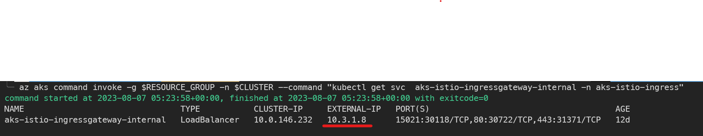

# Sample Test App for AKS

- [Sample Test App for AKS](#sample-test-app-for-aks)
  - [Use cases](#use-cases)
    - [1. `outbound-test-config.yml`](#1-outbound-test-configyml)
    - [2. `istio-internal-config.yml`](#3-istio-internal-configyml)
  - [Pre-requisites](#pre-requisites)
  - [Deploying external API app](#deploying-external-api-app)
  - [Running in local](#running-in-local)
  - [Upload the image to Azure Container Registry](#upload-the-image-to-azure-container-registry)
  - [Deploying to Azure Kubernets Service](#deploying-to-azure-kubernets-service)
  - [Monitor result](#monitor-result)
    - [Outbound Test Config](#outbound-test-config)
    - [Internal LB Test Config](#internal-lb-test-config)
    - [Istio Internal Test Config](#istio-internal-test-config)


There are multiple use cases in this repo. 

Check `manifest` folder for `yaml` files. Check `api-call-app` folder for the sample app, and check `external-api-app` folder for the external api app.

## Use cases

### 1. `outbound-test-config.yml`
Example of **`application gateway ingress controller`** with `kubenet`. Calls external api. Track down what is the source ip address of the request.

### 2. `istio-internal-config.yml`
Example of `Istio Gateway(ServiceMesh)` integrated with AKS. Configured with Internal Load Balancer + Istio Gateway + Istio VirtualService. For more information about `Istio Gateway`, check this [page.](ISTIO_README.md)

## Pre-requisites
* Resource group

## Test scenario 1: `api-call-app` in AKS & `external-api-app` in App service. Call external api from AKS.

### Deploying external API app

This demo used Azure App Service with `Python 3.11` runtime.

Deploy external-api with `SCM_DO_BUILD_DURING_DEPLOYMENT` set to `1` & `pip install -r requirements.txt && python -m uvicorn main:app --host 0.0.0.0` as startup command.

After deployment, try `curl <YOUR_URL>` to see if it works.
It needs to reply with `{"message":"Hello World"}`.

> Since python applications need additional settings within code level for the Application Insights & Loggings, this app is using `opencensus-ext-azure` library to automatically send logs to Application Insights.

### Running in local

Update `main.py` request url to the external api app.

```python
response = requests.get(<YOUR_URL>)
```

```bash
cd api-call-app
docker build -t outbound-test-app .
docker run -p 80:80 outbound-test-app
```
Go to `localhost:80` in browser.

Press `Click me` button to see `Hello World`.

### Upload the image to Azure Container Registry

1. Create Azure Container Registry
```bash
az acr create --resource-group myResourceGroup --name <acrName> --sku Basic
```

2. Login to the registry
```bash
az acr login --name <acrName>
```

3. Get ACR server name.
```bash
az acr list --resource-group myResourceGroup --query "[].{acrLoginServer:loginServer}" --output table
```

4. Change the image name & tag
```bash
docker tag outbound-test-app <acrLoginServer>/outbound-test-app:v1
```

5. Push images to registry
```bash
docker push <acrLoginServer>/outbound-test-app:v1
```

<!-- ## Editing `outbound-test-app.yaml` manifest file for `Azure CNI`(Advanced Networking)
If you are using Azure CNI(Advanced networking) for the cluster, you need to delete `outbound-test-service` from the manifest file.

This is because when you use `kubenet` as the networking plugin, the pods are assigned an IP address from another subnet from the Azure VNET. This means that the pods do not know each others' IP addresses and cannot communicate with each other directly. They need a single ClusterIP service to be able to communicate with each other.

In conclusion, using `kubenet` would not benefit from using the Application Gateway Ingress Controller as specified in this [documentation](https://azure.microsoft.com/en-us/blog/application-gateway-ingress-controller-for-azure-kubernetes-service/). 

The benefits of using the AGIC are first, reducing the additional hops and connecting directly to the pods and second, using the Application Gateway features such as WAF, URL-based routing, SSL termination, etc. However as mentioned, `kubenet` does not allow the pods to communicate with each other directly and therefore would actually miss the first benefit of using the AGIC.

```yml
apiVersion: apps/v1
kind: Deployment
metadata:
  name: outbound-test-app
spec:
  replicas: 2
  selector:
    matchLabels:
      app: outbound-test-app
  strategy:
    rollingUpdate:
      maxSurge: 1
      maxUnavailable: 1
  minReadySeconds: 5 
  template:
    metadata:
      labels:
        app: outbound-test-app
    spec:
      nodeSelector:
        "beta.kubernetes.io/os": linux
      containers:
      - name: outbound-test-app
        image: voteappacr0626.azurecr.io/outbound-test-app:v1
        ports:
        - containerPort: 80
        resources:
          requests:
            cpu: 250m
          limits:
            cpu: 500m
# ---
# apiVersion: v1
# kind: Service
# metadata:
#   name: outbound-test-service
# spec:
#   #type: LoadBalancer
#   ports:
#   - port: 80
#   selector:
#     app: outbound-test-app
---
apiVersion: networking.k8s.io/v1
kind: Ingress
metadata:
  name: outbound-test-app
  annotations:
    kubernetes.io/ingress.class: azure/application-gateway
spec:
  rules:
  - http:
      paths:
      - backend:
          service:
            name: outbound-test-app #Update here to outbound-test-app
            port:
              number: 80
        path: /
        pathType: Prefix
``` -->

### Deploying to Azure Kubernets Service
1. Create AKS
```bash
az aks create --resource-group myResourceGroup --name myAKSCluster --node-count 1 --enable-addons monitoring --generate-ssh-keys --attach-acr <acrName>
```

2. Get AKS credentials
```bash
az aks get-credentials --resource-group myResourceGroup --name myAKSCluster
```
3. Update manifest file
```bash
vi outbound-test-app.yaml
```
Replace image name with your ACR image name.
```yaml
containers:
      - name: outbound-test-app
        image: <acrLoginServer>/outbound-test-app:v1
```

4. Deploy app 
  
    i) `outbound-test-config.yml`: Example of **`application gateway ingress controller`** with `kubenet`
   ```bash
   kubectl apply -f outbound-test-config.yml
   ``` 

   ii)  `internal-lb-test-config.yml`: Example of `internal load balancer` with `application gateway` **infront**

   ```bash
   kubectl apply -f internal-lb-test-config.yml

### Monitor result
#### Outbound Test Config
Go to the Web App you deployed earlier. Click `Logs` in the left menu. Check the HTTP requests logs.


#### Internal LB Test Config
1. Check Internal LB
   ```bash
   kubectl get service
   ```

   Get detail info.
   ```bash
   kubectl describe service internal-app
   ```

   The `CLUSTER-IP` shows internal ip address from the service CIDR. The `EXTERNAL-IP` is from the subnet where AKS is actually placed, and it is **not a real public ip address**. It is the internal ip address of the load balancer which is used to access the backend pools.

   

2. CURL internal load balancer.

   * Create temporary pod to test.
   ```bash
   kubectl run tmp-shell --rm -i --tty --image nicolaka/netshoot -- /bin/bash
   ```

   ```
   curl http://<INTERNAL LB's EXTERNAL IP>/callapi
   ```

   * Result
   ```bash
   Hello World!
   ```


3. Check AKS logs. Look for container logs.

## Test scenario 2: Istio Service Mesh add-on with private LB

### Pre-requisites
Follow [this document](https://learn.microsoft.com/en-us/azure/aks/istio-deploy-addon) to enable Service Mesh add-on and deploy sample application with sidecar injection enabled.

### Istio HTTP/HTTPS configuration

`istio-internal-config.yml`
* Choose HTTP/HTTPS. Open `istio-internal-config.yml` and uncomment the protocol you want to use.
```bash
  - port:
  # HTTPS protocol uses TLS passthrough
  number: 443
  name: https
  protocol: HTTPS
tls:
  mode: SIMPLE
  credentialName: https-secret
  # HTTP
  # number: 80
  # name: http
  # protocol: HTTP
```
* If you want to make it HTTPS, you need to create a secret called `https-secret`. This should be a TLS certificate and key pair. **If it is signed by a certified CA**, such as Google, the **CA certificate should be included in the secret along with the server certificate and key pair.** 
* If it is not signed by a CA and you want to **make your own CA**, you should set CA certificate & key pair first. This procedure can use [AKS custom CA add-on](https://learn.microsoft.com/en-us/azure/aks/custom-certificate-authority).
* After that, create a server certificate and key pair signed by the CA. Then, create a secret with the CA certificate, server certificate and key pair.
  ```bash
  kubectl create -n aks-istio-ingress secret tls https-secret --key=<KEYFILE> --cert=<CERTFILE>
  ```

### Istio Internal Test Config
> If you deployed `private` AKS cluster, follow this step. If its public, skip to this step.

1. Use `invoke command` to get the ip address of the internal load balancer.
  ```bash
   az aks command invoke -g $RESOURCE_GROUP -n $CLUSTER --command "kubectl get svc aks-istio-ingressgateway-internal -n aks-istio-ingress"
  ```
> This step is for `public` AKS cluster.

1. Use `kubectl get svc` to get the ip address of the internal load balancer.
    ```bash
    kubectl get svc aks-istio-ingressgateway-internal -n aks-istio-ingress
    ```

    Retreive the **EXTERNAL_IP** address.

  

2. For private cluster, use additional VM inside the same VNet with AKS cluster to make curl.
  ```bash
  curl -v "https://10.1.1.8:443"
  ```

  OR 

  ```bash
  curl -v "http://10.1.1.8:80"
  ```

2. For public cluster, just make a curl anywhere you want.

  ```bash
  curl -v "https://10.1.1.8:443"
  ```

  OR 

  ```bash
  curl -v "http://10.1.1.8:80"
  ```
